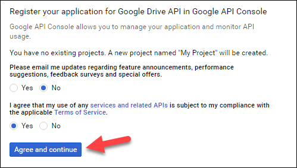
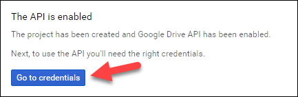
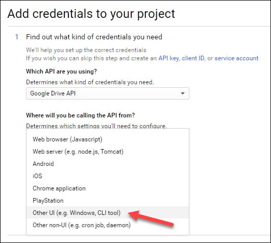
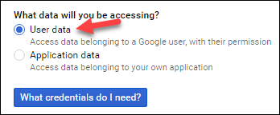
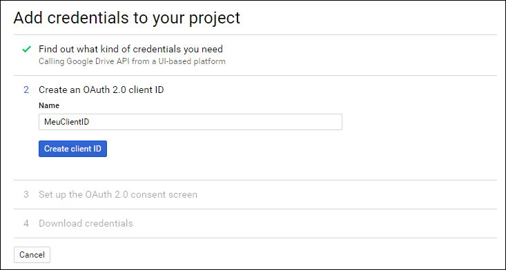
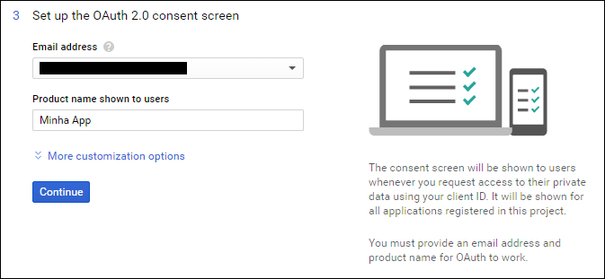
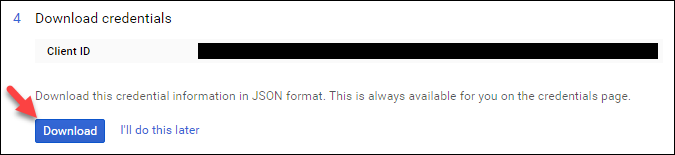
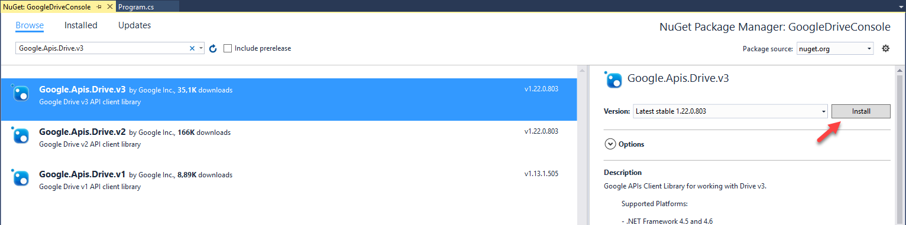
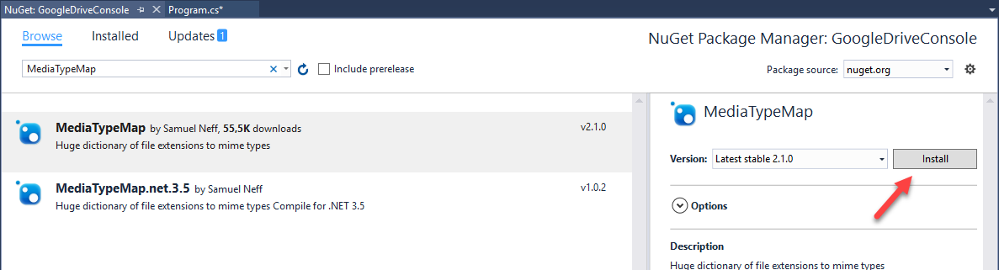

# GoogleDriveTool
CSharp implementation of Google Drive API v3 

```
+ Usage GDriveTool.exe <parameters>

  Paramenters:
  -cf <new foldername> <optional destinationFolderId>           Create a Folder
  -cp <originId> <new filename> <optional destinationFolderId>  Copy a file
  -cpall <originId> <destId>                                    Copy all files and folders recursively
  -l <parentFolderId root/id>                                   List items of a location
  -lf <parentFolderId root/id>                                  List files of a location
  -ld <parentFolderId root/id>                                  List folders of a location
  -s <name> <optional includeTrash True/Fase>                   Search a File
  -del <fileId>                                                 Delete a file/Folder
  -u <filePath> <optional parentFolderId>                       Upload a File
  -ru <filePath> <fileId>                                       Resume Upload
  -d <fileId> <destinationFilename>                             Download File
```

### The Google Drive API 
Google Drive has an extensive API that enables you to manipulate the contents of your accounts in projects that use any programming language that supports REST services. At the time of writing this article, the API is in its third version.

The API page itself has some examples in C # (such as this quickstart). However, these examples are very simple and with little explanation of what is being done at each stage. 

### Generating the file with the credentials 
First, it's necessary to create an google application using the Google Drive API and  enable API support in our account. Also, you must generate a file with your credentials. If you don't have an google application key yet, [this is the link to the wizard](https://console.developers.google.com/start/api?id=drive).

The first step is very simple: you have to agree to the terms of service.


By agreeing to the terms, the API will be activated in our account and we will be able to continue with the next step, which is the creation of our credentials file:


Next, choose the Google Drive API and the " Other UI " option, since it's a Windows console application:



Then, it's possible to make a very interesting configuration for the credentials file, which basically answers the following question: this credential file will give access to all the files and folders of Google Drive or only the files and folders generated by this specific application? Choose the option that best fits your application scenario and proceed to the next step. 

In this example, I chose the " User data " option, which gives access to all the files and folders of the account:


Now, it's time to choose a name for the Client ID and product. Also, if your account is connected to other Google accounts, you'll need to select the email for the account you want to use:



Ready! Finally we got to the last step of the wizard, where we were able to download the file with the credentials. Click the " Download " button and save the file " client_id.json " in a location that is accessible by the application:



### Adding the Google Drive API reference in the project 

Google itself implemented a set of .NET help classes that encapsulate API calls in a more user friendly way. This set of classes is published in NuGet with the name " Google.Apis.Drive.v3 ", that is, to add the reference in our project we just look for this term in the " NuGet Package Manager " window or we can also execute the command " Install-Package Google.Apis.Drive.v3 "in the" Package Manager Console ":



### Adding the MediaTypeMap reference in the project 

In order to upload files using Google Drive API it's necessary define the " mime type" of the file.
If you do not know what " mime type " is, it is an identifier used to define the type of a file. For example, " text / plain " is the " mime type " for text files, " image / jpeg " is the " mime type " for jpg images, and so on. This type of identifier is widely used in web applications when making a request.

To help us with the calculation of the " mime type ", this project uses the MimeTypeMap library, which is basically a giant dictionary of " mime types " by file extension. Add a reference to this library by searching for " MediaTypeMap " in NuGet:

